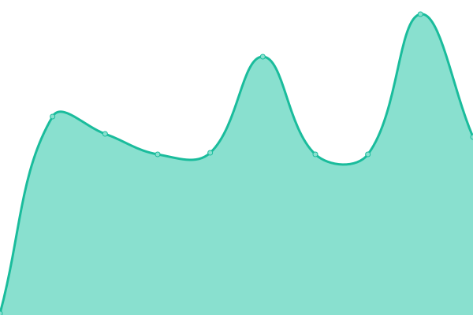

# [📊 OpenClaw Status](https://status.openclaw.rocks)

This repository contains the uptime monitor and status page for [OpenClaw.rocks](https://openclaw.rocks), powered by [Upptime](https://github.com/upptime/upptime).

<!--start: status pages-->
<!-- This summary is generated by Upptime (https://github.com/upptime/upptime) -->
<!-- Do not edit this manually, your changes will be overwritten -->
<!-- prettier-ignore -->
| URL | Status | History | Response Time | Uptime |
| --- | ------ | ------- | ------------- | ------ |
|  [OpenClaw.rocks](https://openclaw.rocks) | 🟩 Up | [open-claw-rocks.yml](https://github.com/openclaw-rocks/status/commits/HEAD/history/open-claw-rocks.yml) | 

 1122ms
     
 | 

<a href="https://status.openclaw.rocks/history/open-claw-rocks">100.00%</a>
    

|  [Health API](https://openclaw.rocks/api/health) | 🟩 Up | [health-api.yml](https://github.com/openclaw-rocks/status/commits/HEAD/history/health-api.yml) | 

 135ms
     
 | 

<a href="https://status.openclaw.rocks/history/health-api">100.00%</a>
    

<!--end: status pages-->
